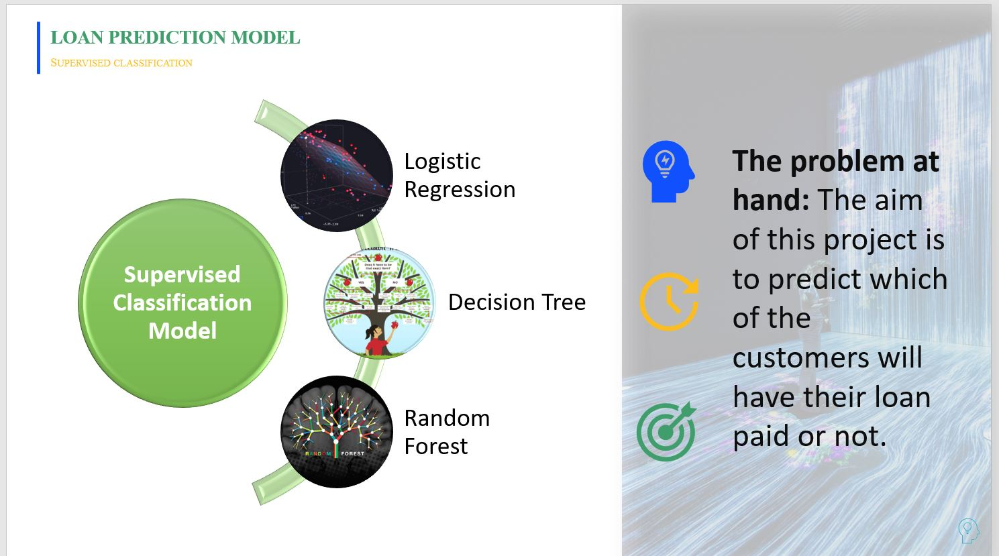
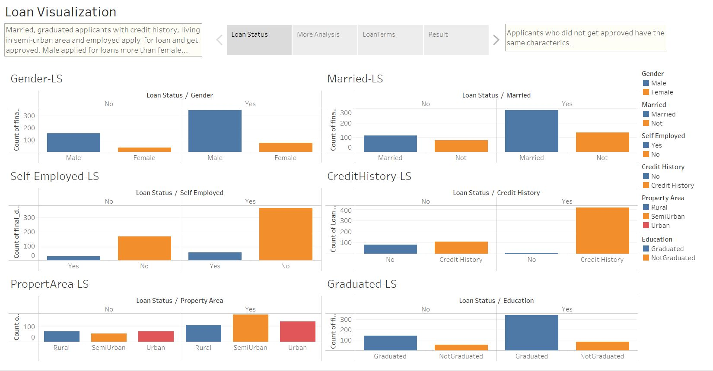
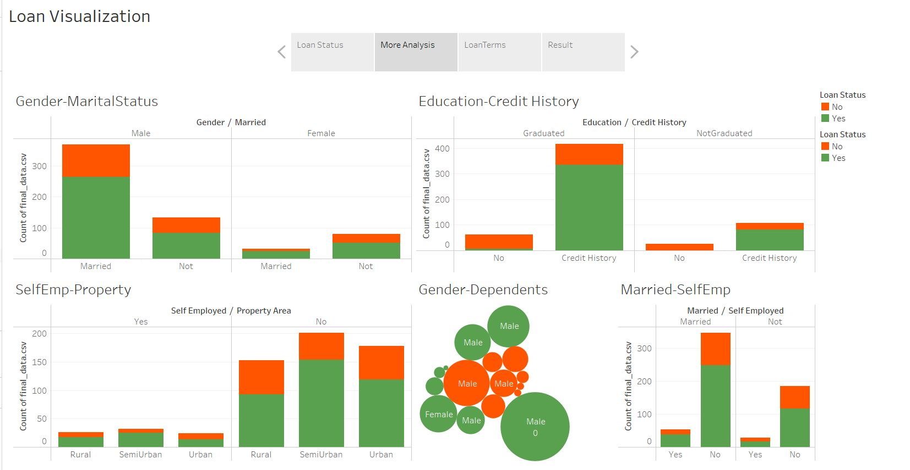
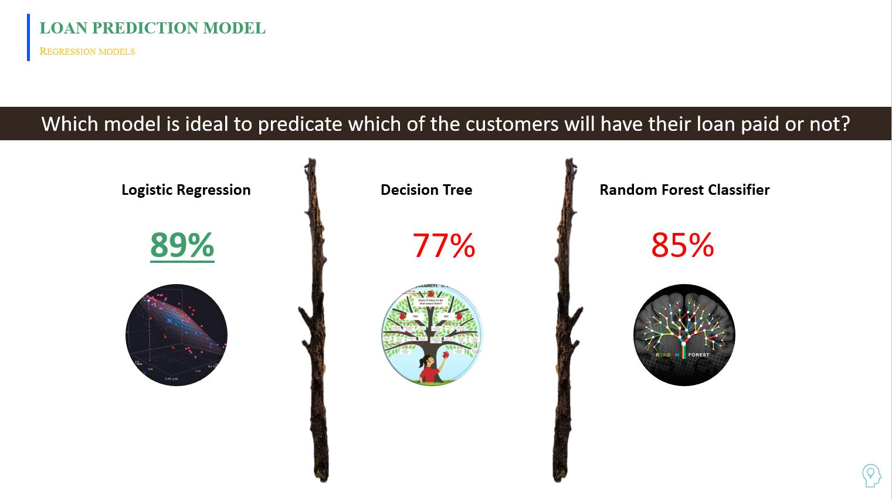

# MachineLearning and Visualization

Loan Prediction Project 

#Situation Analysis: 

In finance, machine learning algorithms are used to detect fraud, automate trading activities, and provide financial advisory services to investors.
Machine learning can analyze millions of data sets within a short time to improve the outcomes without being explicitly programmed. by CFI

#Data Source:  Kaggle, the home of Data Science

#Objective of Machine Learning Model
The goal for this project is to predict which of the customers will have their loan paid or not. 
Therefore, this is a supervised classification problem to be trained with algorithms like:
- Logistic Regression
- Decision Tree
- Random Forest

#Data Cleaning Process

#Exploratory Data Analysis: Visualization in Tableau

Encoding and Separating for Training
Running Three Machine Learning Models

Model Results: The Logistic Regression Model showed the best result

