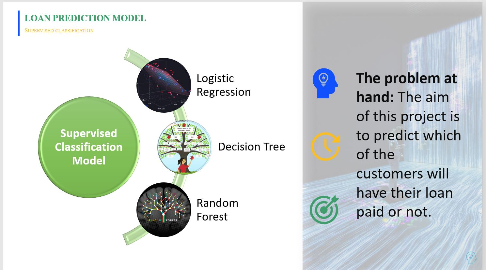
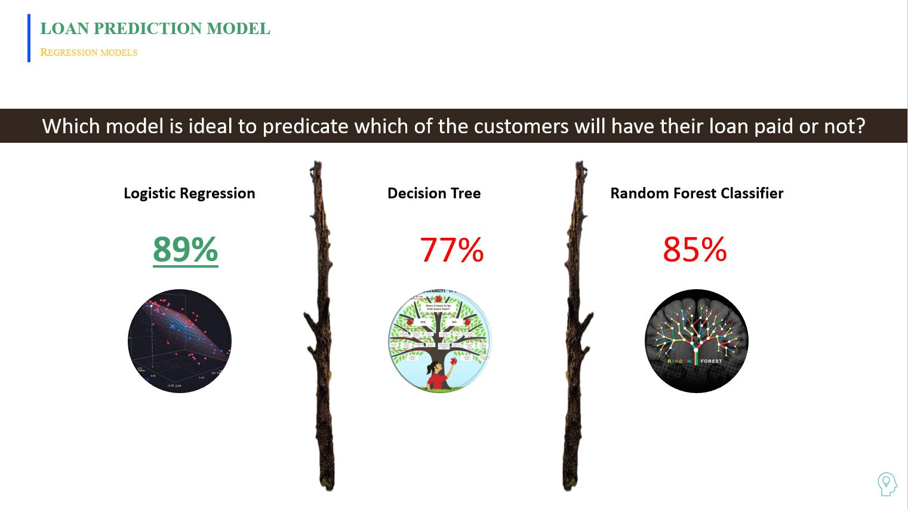

# MachineLearning and Visualization

Loan Prediction Project 

Process: 

Situation Analysis

Data Source: 
Kaggle, the home of Data Science

Objective of Machine Learning Model

Classification Model Selection

Data Cleaning Process

Exploratory Data Analysis: Visualization in Tableau

Encoding and Separating for Training

Model Results 

